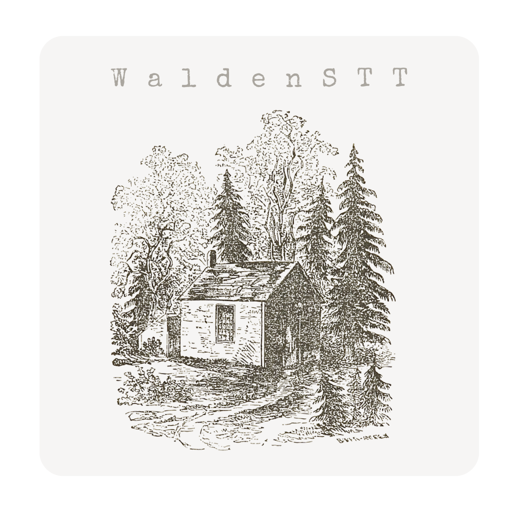

# WaldenSTT
WaldenSTT is a graphical interface for [absadiki's pywhispercpp](https://github.com/absadiki/pywhispercpp/), a speech to text tool
which itself is built on  [whisper.cpp](https://github.com/ggerganov/whisper.cpp)

WaldenSTT was created by JT for the folks at CiTR to make it easier to autogenerate text transcriptions of their radio shows.




# Linux, Mac, Windows

Linux users: Continue to Quick Start.

Mac users: Don't have access to bash? Install homebrew

Windows users: Don't have access to bash? Install WSL.

# Quick Start

## Install WaldenSTT

```
bash setup.sh
```

OR

```
python3 -m venv venv
source venv/bin/activate
pip install pywhispercpp
python3 setup_models.py
```

## Run the program:

```
bash WaldenSTT.sh
```

or run the WaldenSTT.sh program as an executable.

## Instructions

You might need to install pip. To do that, follow the instructions on python.org:
https://packaging.python.org/en/latest/tutorials/installing-packages/

Next, you need to insitall the pywhispercpp package.

## pywhispercpp Installation

### Via Pip

* Basic pre-built version available using pip

```shell
pip install pywhispercpp
```

### From source

* For the best performance, you need to install the package from source:
  
  ```shell
  pip install git+https://github.com/absadiki/pywhispercpp
  ```
### License

See [License](License.md)

#### A Note on licensing: 
WaldenSTT is built on Abdeladim Sadiki's python bindings for WhisperCPP. I wanted to make sure people using my code had access to these license details so I have included them all in one file. For any use of this code, you should refer to the previous licenses. My own (very minimal) intervention is simply an accessibility layer. It is a scholarly/pedagogical tool meant to improve access and encourage use of these tools.

jt-xyzzy/WaldenSTT (CC BY)

absadiki/pywhispercpp (MIT License)

ggml-org/whisper.cpp (MIT License)

### Resources

More info on [available-models-and-languages](https://github.com/openai/whisper?tab=readme-ov-file#available-models-and-languages) from open github.com/openai/whisper

### History

WaldenSTT was originally created for CiTR campus radio station at the University of British Columbia to assist programmers in creating accessible autogenerated transcriptions of their radio shows.
